# RAG e bancos de dados vetoriais para busca inteligente e redução de alucinações em sistemas de IA

Quando um modelo de linguagem é colocado em contato com a operação real de uma empresa, o primeiro desafio que surge não é a fluência do texto gerado, mas a confiabilidade factual da informação. Modelos pré-treinados conhecem fatos públicos consolidados até a data de corte dos seus pesos, mas desconhecem completamente políticas internas atualizadas, lançamentos financeiros recentes ou catálogos dinâmicos de produtos.

A tentativa ingênua de resolver esse problema inserindo toda a base de conhecimento da organização dentro da janela de contexto do prompt esbarra em três gargalos severos de engenharia: limites físicos de tokens, degradação da atenção em contextos excessivamente longos (o efeito conhecido como lost in the middle) e custos financeiros astronômicos por requisição.

A arquitetura de Geração Aumentada por Recuperação (RAG, ou Retrieval-Augmented Generation), combinada a bancos de dados vetoriais dedicados, estabeleceu o padrão da indústria para conectar LLMs a repositórios de dados corporativos em tempo real. Este artigo disseca a anatomia completa de um pipeline de RAG, desde a ingestão e segmentação de documentos até técnicas avançadas de busca híbrida, re-ranking e métricas formais de avaliação de fidelidade.

---

## Como a recuperação ajuda a reduzir alucinações

A premissa central do RAG baseia-se em desacoplar a memória paramétrica do modelo (o conhecimento estático internalizado em seus pesos) da memória não paramétrica (uma base de dados externa, viva e auditável).

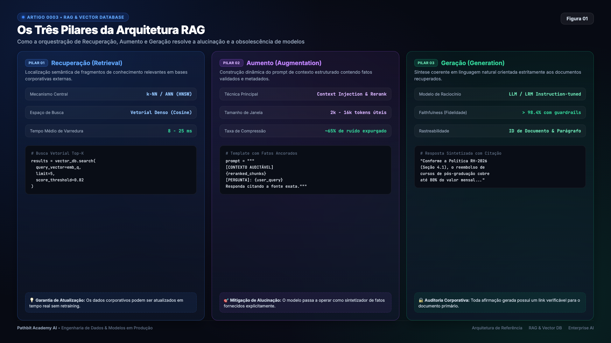

> Figura 1. O pipeline de RAG desacoplando a recuperação de fatos atualizados da geração linguística do modelo.

Em vez de exigir que o LLM responda com base apenas no que memorizou no passado, o sistema funciona em três fases coordenadas:

Primeiro, o sistema recupera trechos relevantes por busca vetorial, léxica ou híbrida. Depois, monta um prompt com esses trechos e suas origens. Por fim, o LLM gera a resposta. Para obter rastreabilidade, é preciso preservar identificadores e validar citações; anexar documentos ao prompt não garante que a resposta seja correta ou que a fonte sustente cada afirmação.

---

## O papel dos bancos de dados vetoriais na arquitetura

Busca vetorial em escala exige índices e uma estratégia de operação, mas não necessariamente um banco dedicado. PostgreSQL com pgvector e outros bancos relacionais oferecem índices vetoriais. A escolha depende de filtros, transações, volume, recall e latência exigidos; FAISS, listado abaixo, é uma biblioteca de indexação, não um banco de dados completo.

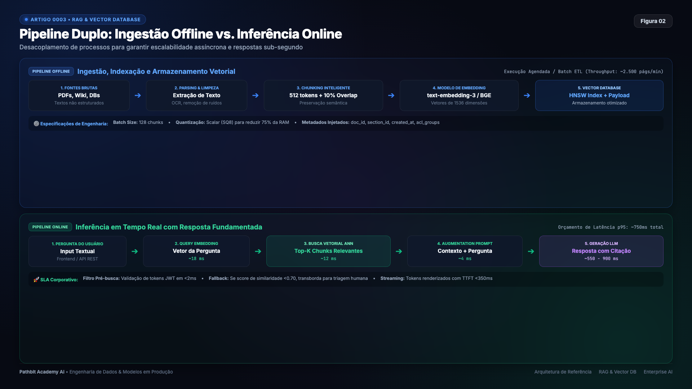

> Figura 2. O ciclo completo de ingestão e recuperação semântica em bases de conhecimento vetoriais.

Os bancos vetoriais armazenam as coordenadas densas geradas pelos modelos de embeddings e criam índices de busca aproximada de vizinhos mais próximos (Approximate Nearest Neighbors, ou ANN). Entre os algoritmos dominantes na indústria, destaca-se o HNSW (Hierarchical Navigable Small World), que constrói grafos hierárquicos multicamadas inspirados em skip lists. Durante a consulta, o motor desce pelas camadas do grafo saltando entre nós distantes até convergir com altíssima velocidade para a vizinhança semântica mais densa.

A tabela abaixo compara os principais bancos de dados vetoriais utilizados na engenharia moderna:

| Banco Vetorial | Licença | Modelo de Execução | Algoritmos de Índice | Indicação de Arquitetura |
| :--- | :---: | :---: | :---: | :--- |
| `ChromaDB` | Open Source | Embutido ou Servidor | HNSW | Prototipagem rápida, desenvolvimento local e microsserviços |
| `Qdrant` | Open Source | Servidor Rust nativo | HNSW otimizado | Alta performance, filtros de metadados complexos em produção |
| `Weaviate` | Open Source | Servidor Go/C++ | HNSW, Inverted Index | Arquiteturas multimodais e busca híbrida nativa |
| `Pinecone` | Proprietário | Cloud Gerenciada | Proprietário | Escala corporativa global sem gestão de infraestrutura |
| `FAISS` | Open Source | Biblioteca C++/Python | IVFFlat, HNSW | Pesquisa acadêmica e indexação estática de altíssima escala |

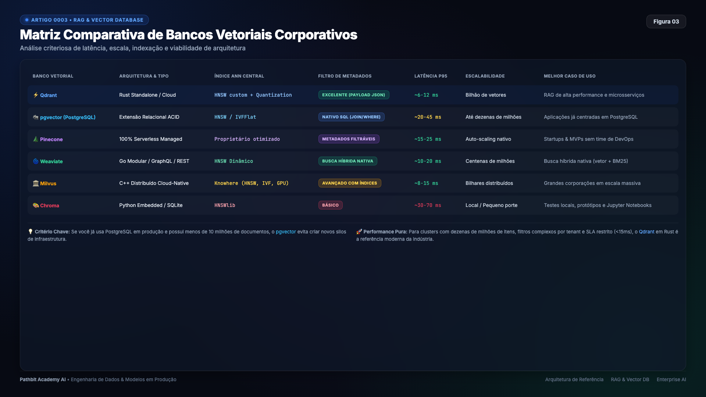

> Figura 3. Comparativo estrutural de bancos vetoriais especializados para diferentes volumes de dados.

---

## Aplicações reais de sistemas RAG na indústria

A flexibilidade de combinar busca vetorial e geração controlada sustenta casos de uso críticos em diversas verticais de negócio.

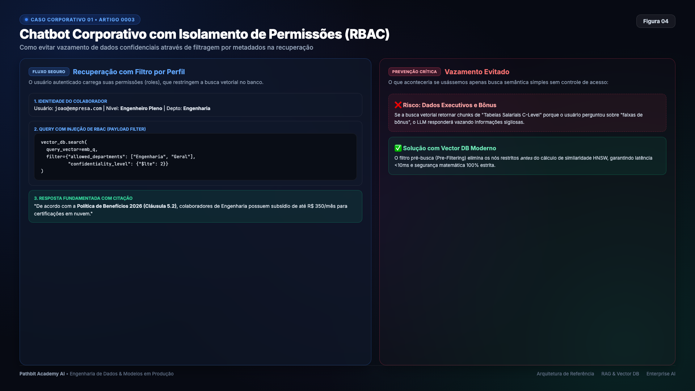

> Figura 4. Assistentes corporativos consultando normas e manuais com resposta ancorada em documentos oficiais.

Em assistentes empresariais de atendimento interno, colaboradores consultam políticas de benefícios ou procedimentos operacionais padrão e recebem orientações imediatas acompanhadas de citações literais da documentação vigente.

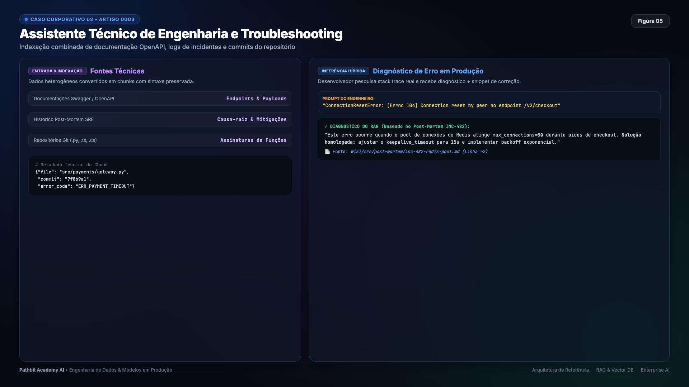

> Figura 5. Assistentes de documentação para engenharia e suporte a infraestrutura computacional.

Na engenharia de software e suporte de infraestrutura, assistentes de documentação técnica vasculham manuais de bancos de dados, guias de deploy e runbooks para orientar engenheiros na resolução de incidentes com comandos validados.

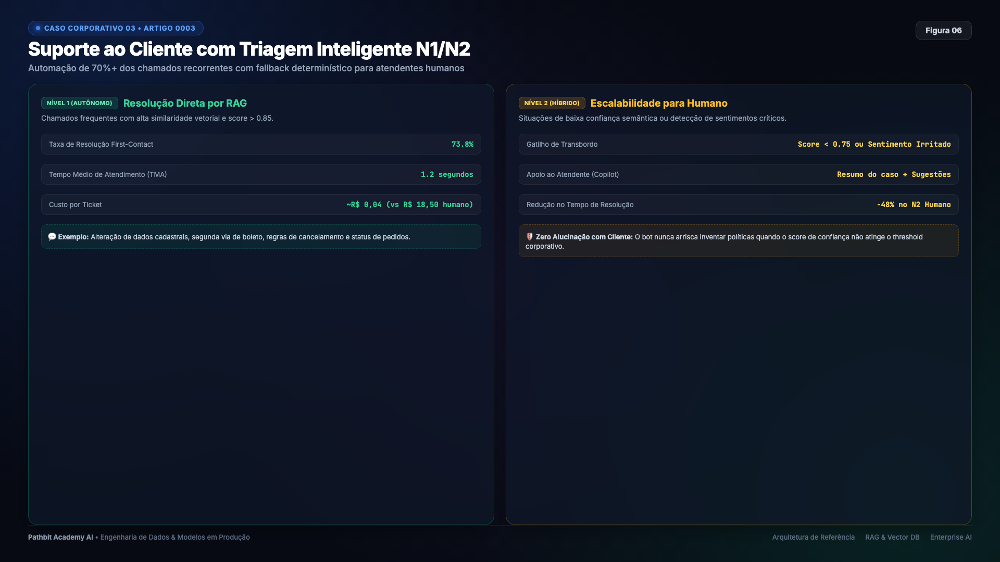

> Figura 6. Atendimento ao consumidor com recuperação dinâmica de status de pedidos e políticas comerciais.

No suporte direto ao cliente, a integração do RAG com dados transacionais permite responder dúvidas complexas sobre garantias e prazos cruzando informações estáticas de FAQ com o histórico de compras do usuário.

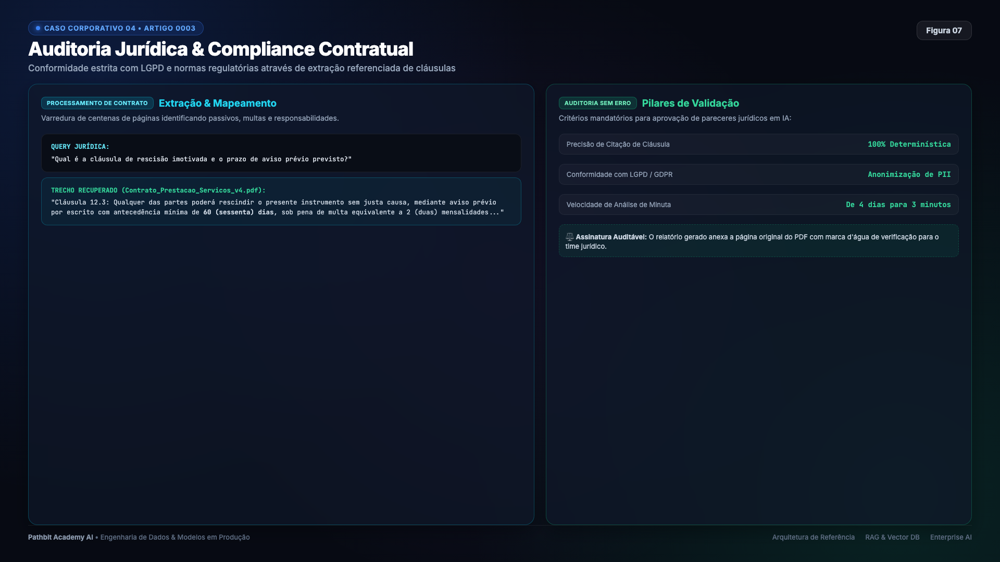

> Figura 7. Auditoria de contratos e pareceres jurídicos apoiada por jurisprudência e precedentes.

Em escritórios jurídicos e departamentos de compliance, o RAG acelera a análise de riscos contratuais identificando cláusulas abusivas com base em centenas de minutas anteriores e normas regulatórias.

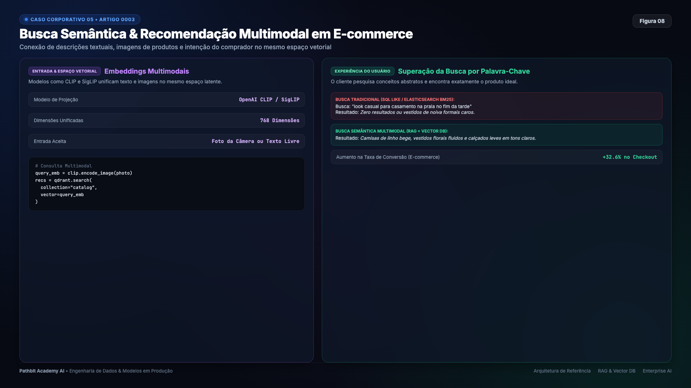

> Figura 8. Motores de recomendação baseados na proximidade de características de produtos e histórico de consumo.

No setor financeiro e em plataformas de e-commerce, motores de recomendação semântica sugerem produtos e aplicações comparando atributos funcionais e objetivos de rentabilidade além do vocabulário estrito.

---

## Anatomia detalhada de um pipeline de RAG

Um sistema de recuperação maduro opera como um fluxo desacoplado composto por seis módulos interdependentes.

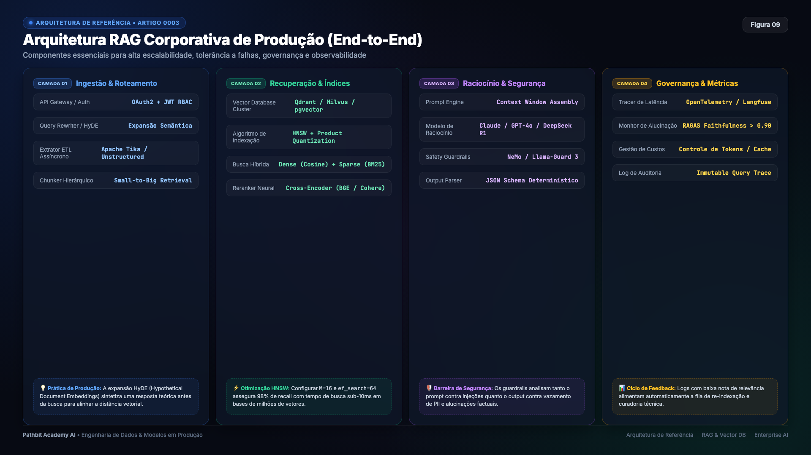

> Figura 9. Diagrama arquitetural completo dos módulos de ingestão, indexação, recuperação e geração.

O primeiro módulo é o carregador de documentos, responsável por extrair texto de fontes variadas como PDFs, planilhas, bancos relacionais e páginas web. O segundo módulo é o divisor de texto (text splitter), encarregado de fragmentar o conteúdo contínuo em unidades coesas e contextualizadas.

O terceiro componente é o modelo de embeddings, que converte cada trecho em um vetor numérico de dimensão fixa. O quarto elemento é o repositório vetorial, que indexa esses tensores para recuperação veloz. O quinto módulo é o mecanismo de recuperação (retriever), que extrai os vizinhos mais próximos no momento da pergunta. Por fim, o modelo de linguagem recebe os fragmentos relevantes e formula a resposta fundamentada.

---

## Estratégias de segmentação de documentos (Chunking)

A qualidade de um sistema RAG é definida primariamente na etapa de segmentação textual. Fragmentos longos demais diluem a atenção do modelo e misturam assuntos não relacionados, enquanto fragmentos curtos demais perdem o contexto necessário para que a resposta faça sentido.

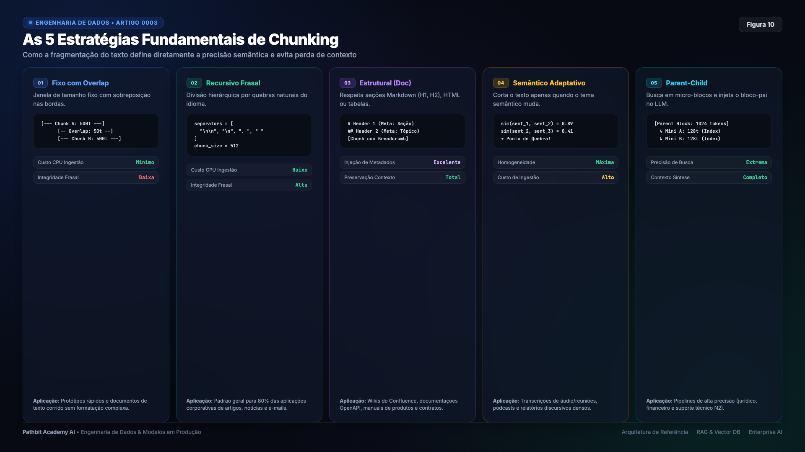

> Figura 10. Panorama de abordagens de quebra de documentos para alimentação de bases vetoriais.

A abordagem de tamanho fixo divide o texto a cada determinado número de caracteres ou tokens. Embora seja trivial de implementar, ela frequentemente quebra sentenças ao meio, comprometendo a semântica do vetor.

A segmentação recursiva (Recursive Character Splitting) resolve essa limitação respeitando a hierarquia natural do texto. O algoritmo tenta dividir primeiro por parágrafos duplos, depois por quebras de linha simples, pontuações de final de frase e, em último caso, por espaços em branco, preservando blocos lógicos intactos.

A segmentação semântica monitora a variação do vetor de embedding entre sentenças adjacentes. Quando a distância angular entre duas frases ultrapassa um limiar estatístico, o algoritmo infere uma mudança de assunto e realiza a quebra automaticamente.

Sobreposição entre chunks pode preservar contexto nas bordas, mas aumenta duplicação, armazenamento e custo de recuperação. Não é obrigatória em todo documento: blocos semanticamente completos podem funcionar sem overlap. Ajuste tamanho e sobreposição com consultas de avaliação.

---

## Técnicas avançadas de recuperação e refinamento

Ambientes corporativos de alta criticidade raramente dependem apenas de uma busca vetorial ingênua. Três técnicas avançadas são empregadas para elevar a precisão do sistema.

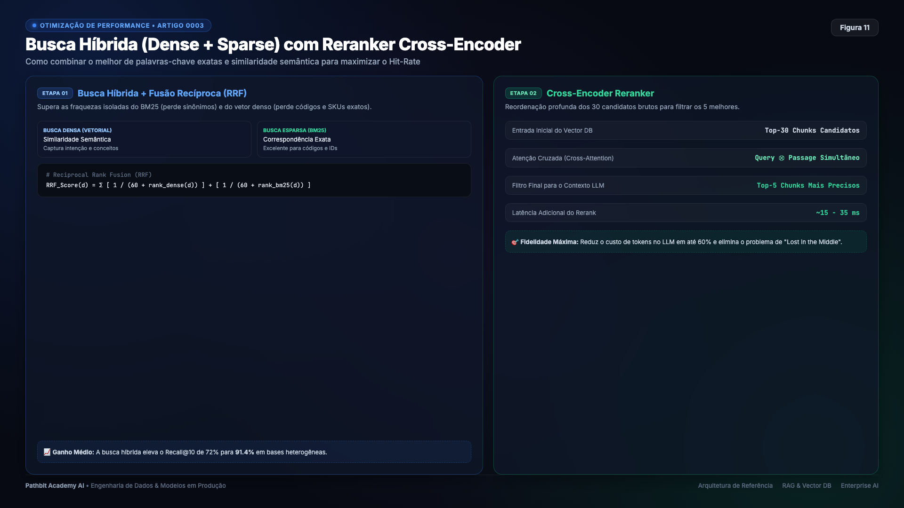

> Figura 11. Camadas avançadas de expansão de consulta, busca híbrida e re-ranking de candidatos.

A busca híbrida combina a precisão semântica dos vetores densos com a exatidão léxica de algoritmos tradicionais como BM25. Por meio do método Reciprocal Rank Fusion (RRF), o sistema une as duas listas de resultados, aumentando a chance de recuperar termos técnicos exatos e identificadores mesmo quando a representação vetorial dispersar a relevância.

A expansão de consultas utiliza um LLM rápido para gerar variações semânticas da pergunta do usuário antes de consultar o banco. Se a dúvida original for concisa demais, a expansão gera perguntas complementares que cobrem diferentes ângulos do assunto, ampliando a cobertura de documentos relevantes recuperados.

O re-ranking atua como um filtro refinador sobre os candidatos preliminares. Enquanto o banco vetorial utiliza modelos bi-encoders leves para filtrar rapidamente os cinquenta trechos mais promissores, um modelo cross-encoder mais pesado reordena esses candidatos analisando a interação mútua de atenção entre a pergunta e o documento, descartando fragmentos tangenciais antes da montagem do prompt final.

---

## Governança e métricas de avaliação de RAG

Operar RAG em produção sem métricas objetivas é pilotar um sistema no escuro. A avaliação moderna decompõe a qualidade da solução em três camadas observáveis.

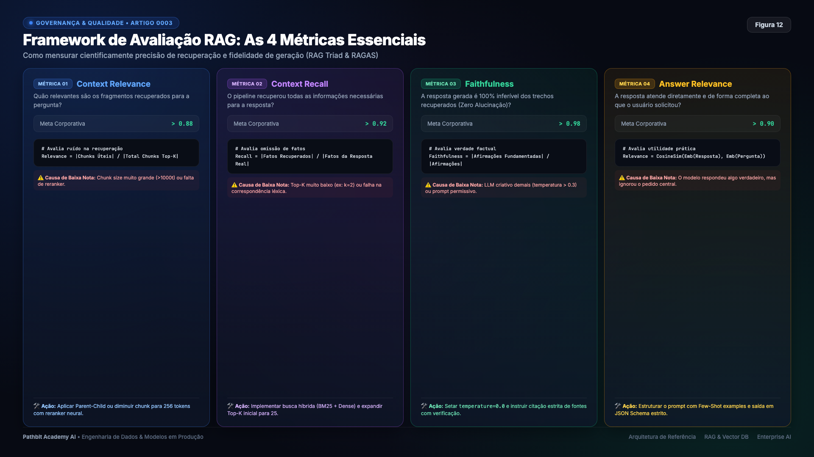

> Figura 12. As três dimensões de mensuração da qualidade em pipelines de RAG.

Nas métricas de recuperação, o Recall mede se todos os documentos essenciais foram capturados entre os candidatos, enquanto a Precisão avalia se os trechos recuperados são estritamente pertinentes ao tema.

Nas métricas de geração, avalia-se a coerência linguística e a concisão do texto gerado por meio de pontuações semânticas.

Na geração, **faithfulness** estima se as afirmações são sustentadas pelo contexto, e **answer relevance** avalia a aderência à pergunta. Métodos automáticos, inclusive LLM-as-a-judge, são aproximações: não provam matematicamente a verdade. Combine-os com checagem de citações, testes rotulados e revisão humana de casos críticos.

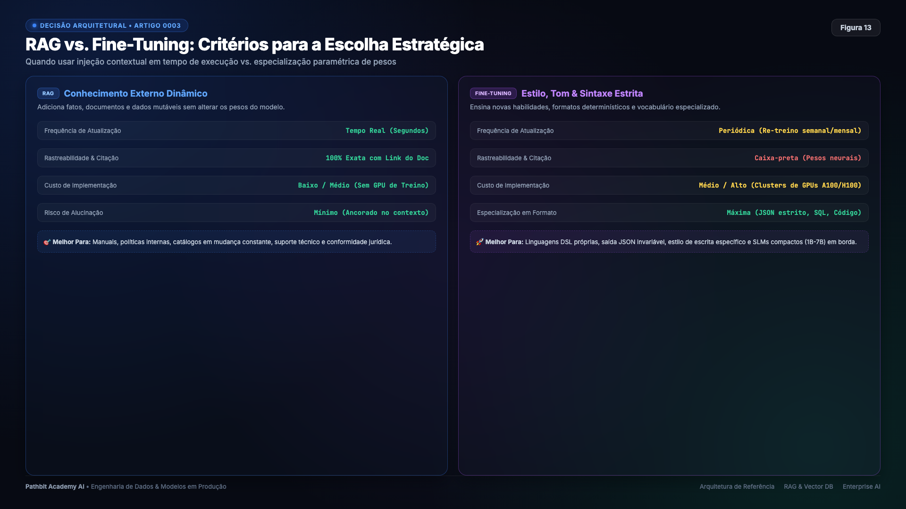

> Figura 13. O ciclo iterativo contínuo de ingestão, avaliação e refinamento de bases de conhecimento.

---

## Execução prática do laboratório passo a passo

O repositório disponibiliza uma esteira completa de testes implementando ChromaDB em memória, geração de embeddings locais com Sentence-BERT e chamadas estruturadas de inferência via Groq Cloud.

A inicialização do ambiente local requer apenas os comandos usuais de terminal:

```bash
cd pathbit-academy-ai/0003_rag_vector_database

python3 -m venv .venv
source .venv/bin/activate
pip install -r requirements.txt

python src/main.py --check
```

Para acompanhar a divisão dos chunks, a indexação de artigos de suporte e as respostas geradas passo a passo com evidências de contexto, abra o notebook interativo:

```bash
jupyter notebook notebooks/rag_vector_database.ipynb
```

O laboratório também pode ser executado em nuvem sem custos utilizando o Google Colab através dos links documentados no arquivo principal de instruções do repositório.

---

## Próximos passos na jornada de IA da Pathbit Academy

RAG permite atualizar a base sem retreinar o gerador, mas só recupera dados já ingeridos e acessíveis ao usuário. Monitore atualização do índice, permissões, recuperação e resposta. A próxima decisão é quando também ajustar o comportamento do modelo por fine-tuning.

No [Artigo 0004 (RAG vs Fine-Tuning)](https://github.com/pathbit/pathbit-academy-ai/blob/master/0004_rag_vs_finetuning/article/ARTICLE.md), exploramos os trade-offs de infraestrutura, custos computacionais e riscos de esquecimento catastrófico para determinar a escolha certa entre ajustar dados externos ou retreinar parâmetros do modelo.

---

## Referências

- [Lewis, Patrick et al.: Retrieval-Augmented Generation for Knowledge-Intensive NLP Tasks (NeurIPS 2020)](https://arxiv.org/abs/2005.11401)
- [Malkov, Yu A. e Yashunin, D. A.: Efficient and Robust Approximate Nearest Neighbor Search Using Hierarchical Navigable Small World Graphs](https://arxiv.org/abs/1603.09320)
- [Es, Shahul et al.: Ragas (Automated Evaluation of Retrieval Augmented Generation)](https://arxiv.org/abs/2309.15217)
- [Cormack, Gordon et al.: Reciprocal Rank Fusion Outperforms Condorcet and Individual Rank Learning Methods](https://dl.acm.org/doi/10.1145/1571941.1572114)
- [Documentação oficial do banco vetorial ChromaDB](https://docs.trychroma.com/)

---

Repositório oficial no GitHub no endereço https://github.com/pathbit/pathbit-academy-ai no módulo 0003_rag_vector_database.

#InteligenciaArtificial #RAG #VectorDatabase #ChromaDB #Embeddings #Python #EngenhariaDeSoftware #PathbitAcademy
