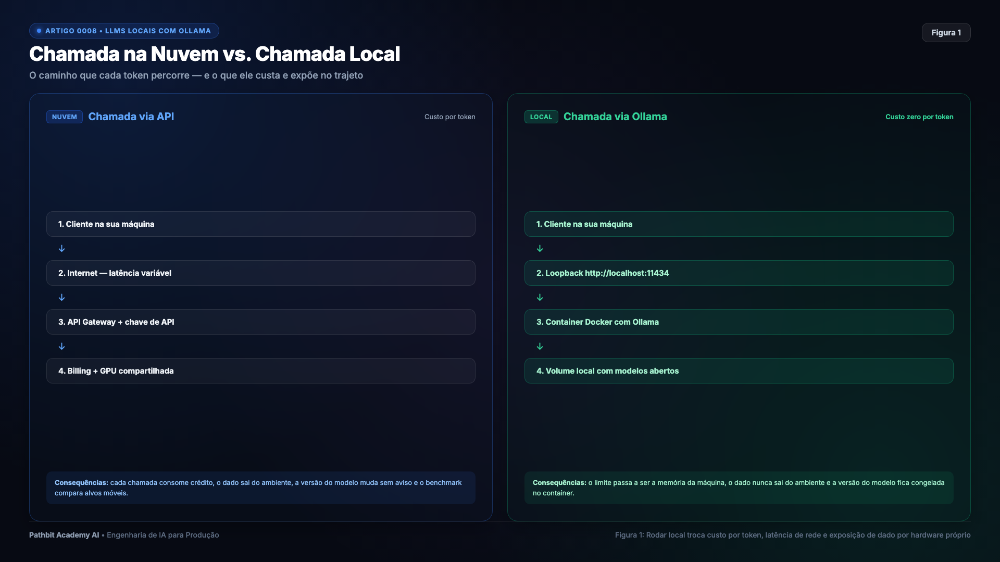
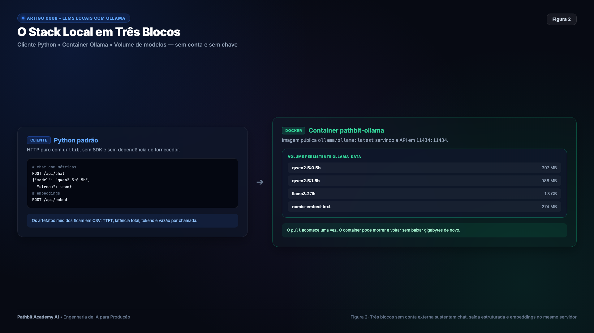
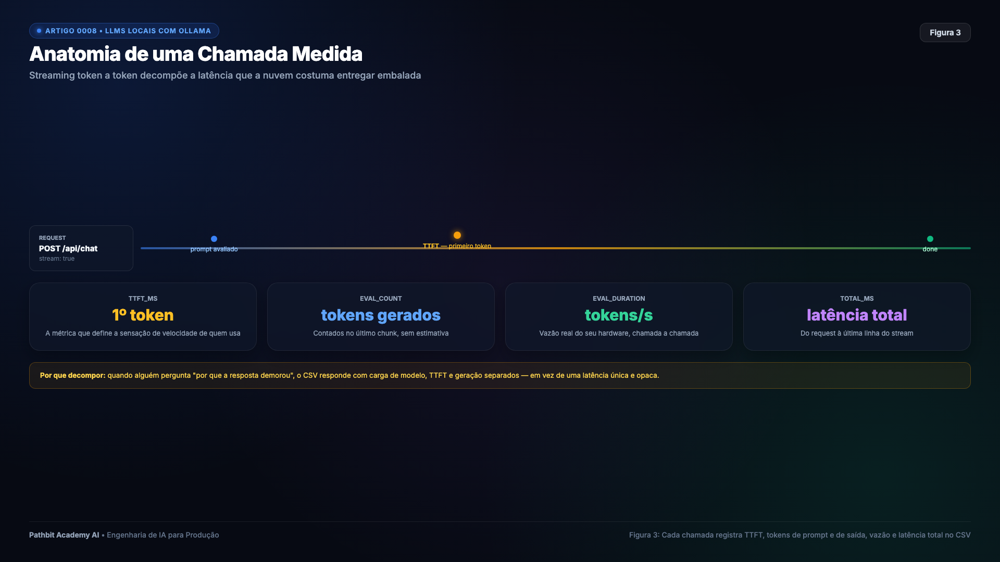
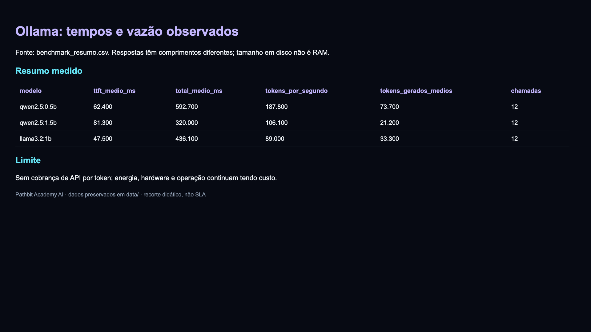
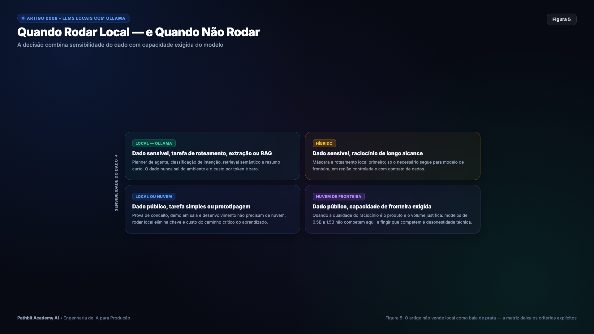

# LLMs locais com Ollama para rodar uma stack de IA 100% offline sem custo por token

Grande parte do material sobre Inteligência Artificial em produção assume uma premissa silenciosa logo na terceira linha de código.

```python
client = OpenAI(api_key=os.environ["OPENAI_API_KEY"])
```

O exemplo funciona, o dashboard fica elegante, a demonstração agrada a diretoria e cada chamada consome centavos no cartão corporativo. Para protótipos de fim de semana, isso é conveniente. Mas para sistemas corporativos de missão crítica, ambientes regulados, laboratórios acadêmicos ou operações de alta volumetria, essa dependência externa cobra um pedágio invisível e perigoso.

Não se trata apenas de economizar na fatura da nuvem, mas de responder a três perguntas fundamentais de engenharia que uma API de terceiros impede que você controle. 

A primeira é a soberania dos dados. Informações confidenciais, prontuários de clientes ou segredos industriais podem cruzar a internet pública e repousar em servidores de terceiros sob jurisdições estrangeiras? A segunda é a estabilidade de versão. O que acontece quando o provedor atualiza o modelo silenciosamente na virada do mês, alterando o comportamento de um agente em produção? E a terceira é a previsibilidade econômica e técnica. Como viabilizar um agente que executa dezenas de chamadas de reflexão por minuto se cada chamada adiciona centenas de milissegundos de latência de rede e gera cobrança contínua?

Este artigo parte exatamente de onde o [Artigo 0007 (Agentes e Tool Calling)](https://github.com/pathbit/pathbit-academy-ai/blob/master/0007_agentes_tool_calling/article/ARTICLE.md) parou. No 0007, construímos um agente autônomo com guardrails, planner e retrieval semântico rodando em memória de processo com Hugging Face. Aqui, damos o passo seguinte de arquitetura, desacoplando o motor de inferência em um servidor dedicado via Ollama em container Docker. O consumo acontece por HTTP puro em loopback, com medição cirúrgica de latência, vazão, memória e saída estruturada, tudo sem chave de API, sem autenticação externa e sem pagar por token gerado.

---

## O que muda quando o modelo mora na sua máquina

A transição da inferência gerenciada na nuvem para a inferência local altera radicalmente a física e a economia do software.



> Figura 1. Na nuvem, cada chamada cruza internet, chaves e faturamento dinâmico. No local, o ciclo inteiro opera dentro dos limites físicos do seu hardware.

São quatro mudanças práticas que transformam a operação do sistema.

Primeiro, a chamada passa a usar loopback, sem o trânsito até um provedor externo. Ainda há custo de HTTP, filas, carregamento dos pesos e inferência. No Docker Desktop para macOS, o container roda em uma VM Linux; usar Docker não equivale a aproveitar a GPU Metal do host. Meça o tempo até o primeiro token e a latência completa.

Segundo, desaparece a cobrança de API por token, não o custo marginal de computação. Energia, ocupação do hardware, refrigeração e operação continuam existindo. A capacidade é finita: aumentar requisições ou contexto pode exigir mais recursos.

Terceiro, o processamento pode permanecer local após baixar pesos e dependências. Isso não garante isolamento absoluto: limite portas a `127.0.0.1`, revise telemetria, logs, ferramentas e permissões. Desconectar a rede é uma opção operacional, não uma propriedade automática de qualquer stack local.

Quarto, a versão do modelo fica congelada. APIs comerciais sofrem atualizações frequentes de pesos e prompts de alinhamento internos que mudam sutilmente o comportamento das respostas ao longo do tempo. No container Docker, os pesos do modelo ficam salvos em um arquivo imutável dentro de um volume dedicado. O teste executado hoje produzirá exatamente o mesmo resultado no próximo ano.

Vale fazer um alerta honesto. Rodar modelos localmente não significa substituir modelos gigantes de fronteira com centenas de bilhões de parâmetros em tarefas de raciocínio enciclopédico. A proposta deste laboratório não é encontrar o modelo mais inteligente do mundo, mas provar o que um modelo compacto de 1 bilhão de parâmetros consegue sustentar com estabilidade e precisão na sua infraestrutura.

---

## Como a inferência local funciona por baixo dos panos

Para operar modelos locais em produção sem surpresas, o desenvolvedor precisa entender o que acontece na memória do sistema operacional entre o envio do prompt e o retorno da resposta.

### Do llama.cpp ao Ollama

O Ollama não é um modelo em si, mas um servidor de gerenciamento escrito em Go que empacota o projeto llama.cpp, criado por Georgi Gerganov. O llama.cpp implementa a arquitetura Transformer em C e C++ puro, desenhada especificamente para executar tensores com máxima eficiência sem exigir frameworks pesados como PyTorch ou runtimes proprietárias de GPU.

O papel do Ollama é fornecer essa camada operacional amigável. O servidor gerencia o download e o armazenamento dos pesos em blobs reutilizáveis, expõe uma API REST padrão com suporte a streaming de texto, distribui as camadas neurais entre CPU e GPU de acordo com os recursos disponíveis e aproveita instruções vetoriais avançadas do processador, a exemplo de AVX2 e AVX-512 em chips x86 ou ARM NEON e Metal nos processadores Apple Silicon.

### A matemática da quantização e o formato GGUF

Um modelo de linguagem em precisão original (FP16) armazena cada parâmetro em 16 bits, o que equivale a dois bytes por peso. Um modelo de 1 bilhão de parâmetros precisaria de pelo menos 2 GB de memória apenas para carregar sua estrutura básica, fora o espaço para contexto.

O formato GGUF viabiliza a execução em computadores comuns por meio de quantização pós-treinamento. Esse processo comprime a representação numérica dos pesos para 8 bits, 4 bits ou até menos.

| Tipo de Quantização | Bits por Peso | Tamanho Llama 3.2 1B | Perda de Perplexidade | Recomendação Prática |
| :--- | :---: | :---: | :---: | :--- |
| FP16 | 16 bits | ~2.5 GB | Nenhuma (referência) | Treinamento e estações com muita memória |
| Q8_0 | 8 bits | ~1.3 GB | Quase imperceptível | Servidores com GPU dedicada |
| Q4_K_M (Padrão) | 4.5 bits | ~800 MB | Mínima | Melhor equilíbrio para CPU e notebooks comuns |
| Q2_K | 2.5 bits | ~500 MB | Significativa | Dispositivos embarcados ou memória muito restrita |

No padrão Q4_K_M adotado pelo Ollama, os pesos são agrupados em blocos e mapeados para inteiros de 4 bits com fatores de escala específicos. O consumo de memória RAM cai mais de 60%, permitindo que o modelo caiba com folga na memória principal de laptops convencionais.

### O gargalo real na largura de banda da memória

Em decodificação de lote pequeno, ler pesos e cache costuma tornar a inferência limitada por largura de banda. A razão abaixo é uma aproximação para modelos densos, sem incluir caches, compute, batching ou paralelismo; MoE não ativa todos os pesos a cada token.

$$\text{Vazão Máxima (tokens/s)} \approx \frac{\text{Largura de Banda de Memória (GB/s)}}{\text{Tamanho dos Pesos do Modelo (GB)}}$$

Dividir 64 GB/s por 1,3 GB resulta em aproximadamente 49 tokens/s nesse modelo simplificado. Isso não é teto universal: cache, pesos ativos, quantização, batching e hardware alteram a relação. Confirme com as métricas de geração do runtime.

### A gestão do KV Cache

Durante a geração, a camada de atenção precisa consultar as chaves e valores calculados para todos os tokens anteriores. Para não recalcular todo o passado a cada novo passo, o motor armazena esse histórico em uma estrutura chamada KV Cache.

O consumo de memória do KV Cache cresce linearmente conforme o histórico da conversa se expande.

$$\text{Memória}_{\text{KV}} = 2 \times n_{\text{camadas}} \times n_{\text{KV heads}} \times d_{\text{head}} \times n_{\text{tokens\_contexto}} \times \text{bytes\_por\_elemento}$$

Na fórmula, use o número de **heads KV**, que pode ser menor que o de query heads em GQA/MQA; multiplique também por sequências concorrentes. Definir o limite de contexto no Ollama pelo parâmetro `num_ctx` é fundamental para evitar que requisições longas consumam toda a RAM da máquina.

---

## O stack mínimo e gratuito em Docker

Para garantir repetibilidade em qualquer ambiente de desenvolvimento, o servidor pode ser configurado em um arquivo docker-compose simples.



> Figura 2. Container, volume persistente nomeado e porta HTTP local compõem toda a infraestrutura necessária.

```yaml
services:
  ollama:
    image: ollama/ollama:latest
    container_name: pathbit-ollama
    ports:
      - "11434:11434"
    volumes:
      - ollama-data:/root/.ollama
    environment:
      - OLLAMA_KEEP_ALIVE=24h
      - OLLAMA_NUM_PARALLEL=2
    restart: unless-stopped
    deploy:
      resources:
        limits:
          memory: 8G

volumes:
  ollama-data:
```

Dois detalhes dessa configuração merecem atenção especial. O volume nomeado `ollama-data` garante que os modelos baixados permaneçam salvos no disco do host, evitando downloads repetidos de vários gigabytes a cada reinício. A variável `OLLAMA_KEEP_ALIVE=24h` impede que o Ollama descarregue o modelo da memória RAM após cinco minutos de inatividade, eliminando a espera de carregamento nas requisições seguintes.

Com o container em execução, os modelos do experimento são baixados com comandos diretos no terminal.

```bash
docker compose up -d
docker exec pathbit-ollama ollama pull qwen2.5:0.5b
docker exec pathbit-ollama ollama pull qwen2.5:1.5b
docker exec pathbit-ollama ollama pull llama3.2:1b
docker exec pathbit-ollama ollama pull nomic-embed-text
```

---

## A anatomia de uma chamada local

A API do Ollama oferece duas formas de entrega da resposta. O modo simples aguarda o texto completo ser gerado para devolver um único JSON. O modo em streaming devolve uma linha JSON para cada novo token gerado.



> Figura 3. TTFT, tempo de avaliação de prompt e vazão de geração decompõem o tempo que a nuvem costuma esconder em uma única métrica opaca.

O modo em streaming é o mais interessante para telemetria porque expõe o tempo até o primeiro token (TTFT).

```python
import json
import time
import urllib.request

def chat_com_metricas(base_url: str, model: str, prompt: str, timeout: float = 300.0) -> dict:
    payload = json.dumps({
        "model": model,
        "messages": [{"role": "user", "content": prompt}],
        "stream": True,
        "options": {"temperature": 0.0, "num_predict": 128}
    }).encode("utf-8")

    req = urllib.request.Request(
        f"{base_url}/api/chat",
        data=payload,
        headers={"Content-Type": "application/json"},
        method="POST"
    )

    start_time = time.perf_counter()
    ttft_ms = None
    chunks_recebidos = []
    final_payload = {}

    with urllib.request.urlopen(req, timeout=timeout) as response:
        for line in response:
            if not line.strip():
                continue
            chunk = json.loads(line.decode("utf-8"))
            texto_token = chunk.get("message", {}).get("content", "")
            
            if texto_token and ttft_ms is None:
                ttft_ms = (time.perf_counter() - start_time) * 1000.0
                
            chunks_recebidos.append(texto_token)
            if chunk.get("done", False):
                final_payload = chunk
                break

    latencia_total_ms = (time.perf_counter() - start_time) * 1000.0
    resposta_completa = "".join(chunks_recebidos)

    eval_count = final_payload.get("eval_count", len(chunks_recebidos))
    eval_duration_ns = final_payload.get("eval_duration", 1)
    prompt_eval_count = final_payload.get("prompt_eval_count", 0)

    vazao_tokens_seg = (eval_count / (eval_duration_ns / 1e9)) if eval_duration_ns > 0 else 0.0

    return {
        "modelo": model,
        "resposta": resposta_completa,
        "ttft_ms": round(ttft_ms, 2) if ttft_ms else round(latencia_total_ms, 2),
        "latencia_total_ms": round(latencia_total_ms, 2),
        "tokens_prompt": prompt_eval_count,
        "tokens_gerados": eval_count,
        "vazao_tok_s": round(vazao_tokens_seg, 2),
    }
```

Essa decomposição isola três momentos distintos da execução. O TTFT mede o tempo de espera até o usuário ver o início da resposta. O tempo de avaliação de prompt mede o processamento inicial da entrada, que é paralelizado na matriz de tensores. E a vazão em tokens por segundo mede a velocidade da fase de decodificação sequencial, que reflete a taxa em que as palavras aparecem na tela.

---

## O benchmark medido na prática

Submetemos três modelos locais a uma série de testes cobrindo geração livre, classificação zero-shot de chamados, extração de entidades e planejamento de ferramentas com saída estruturada.



> Figura 4. Três modelos compactos, mesmos prompts e mesma máquina, transformando a comparação em uma decisão objetiva de engenharia.

Os resultados foram coletados na mesma máquina em processamento puramente em CPU.

| Modelo | TTFT médio (ms) | Total médio (ms) | Tokens/s | Tokens gerados médios | Chamadas |
| :--- | ---: | ---: | ---: | ---: | ---: |
| `qwen2.5:0.5b` | 62,4 | 592,7 | 187,8 | 73,7 | 12 |
| `qwen2.5:1.5b` | 81,3 | 320,0 | 106,1 | 21,2 | 12 |
| `llama3.2:1b` | 47,5 | 436,1 | 89,0 | 33,3 | 12 |

Fonte: `data/benchmark_resumo.csv`. Vazão usa a fase de geração; total inclui
outras etapas. Respostas têm comprimentos diferentes, então comparar somente
latência total não isola velocidade do modelo. Tamanho em disco não é RAM.

O Qwen 0.5B teve maior vazão média, mas não menor latência total. O Llama teve
menor TTFT. Em `structured_output.csv`, os dois Qwen acertaram 5/5 seleções;
o Llama teve 0/5 no validador do payload. Esse teste exige campos e decisão:
a coluna histórica `json_valido` não mede apenas sintaxe JSON. Cinco tentativas
não permitem concluir confiabilidade geral de nenhum modelo.

---

## Embeddings e busca vetorial na mesma instância

Aplicações corporativas frequentemente dependem de busca semântica para encontrar políticas ou artigos de suporte antes de responder ao cliente. No Ollama, o mesmo servidor que processa o chat também disponibiliza o endpoint `/api/embed`, permitindo rodar o modelo nomic-embed-text lado a lado.



> Figura 5. Matriz de decisão objetiva para saber o momento exato de migrar do modelo de nuvem para o modelo local.

O nomic-embed-text gera vetores de 768 dimensões. A model card v1.5 informa até 8.192 tokens, mas o artefato/runtime deste ambiente anuncia 2.048 em `/api/tags`. Cerca de 274 MB é o tamanho baixado, não o pico de RAM. É orientado a inglês; valide português e use prefixos de tarefa quando recomendados pelo modelo.

```python
def gerar_embedding(base_url: str, text: str, model: str = "nomic-embed-text") -> list[float]:
    payload = json.dumps({"model": model, "input": text}).encode("utf-8")
    req = urllib.request.Request(
        f"{base_url}/api/embed",
        data=payload,
        headers={"Content-Type": "application/json"}
    )
    with urllib.request.urlopen(req) as res:
        dados = json.loads(res.read().decode("utf-8"))
        return dados["embeddings"][0]

def similaridade_cosseno(v1: list[float], v2: list[float]) -> float:
    dot = sum(a * b for a, b in zip(v1, v2))
    norm_a = sum(a * a for a in v1) ** 0.5
    norm_b = sum(b * b for b in v2) ** 0.5
    return dot / (norm_a * norm_b) if norm_a and norm_b else 0.0
```

Em `data/embedding_summary.csv`, o recorte com oito documentos registra top-1 de 100%, batch de documentos em **1.278,4 ms** e batch de consultas em **43,7 ms**. Isso demonstra o funcionamento neste conjunto pequeno, não a capacidade de um container de 3 GB nem qualidade geral de busca. O laboratório não mede pico de RAM.

---

## O que quebra na prática

Colocar modelos locais em produção exige atenção a limitações práticas do sistema operacional.

O primeiro risco é o esgotamento de memória e o uso de swap em disco. Se duas requisições simultâneas exigirem contextos longos, o KV Cache pode ocupar toda a RAM disponível. Quando o sistema operacional começa a mover páginas de memória para o disco SSD, a taxa de geração cai bruscamente de 80 tokens por segundo para menos de meio token por segundo. A prevenção envolve definir limites de memória no Docker Compose e limitar o tamanho da janela de contexto no parâmetro `num_ctx`.

O segundo risco é a repetição infinita de texto quando o modelo perde o critério de parada. Modelos compactos podem continuar gerando sentenças repetitivas até atingir o teto de 4.096 tokens. Para evitar isso, a requisição deve sempre incluir um limite seguro no parâmetro `num_predict` e palavras de parada como quebras de linha duplas.

O terceiro aspecto é o aquecimento do processador durante testes contínuos de carga. Sem refrigeração adequada, a CPU atinge temperaturas elevadas e o sistema operacional reduz a frequência de clock para proteger os componentes. Isso faz com que a velocidade de resposta caia pela metade ao longo de uma bateria de testes prolongada.

---

## Execução prática do laboratório passo a passo

Os arquivos de configuração, scripts de automação e o notebook com dados reais estão disponíveis no repositório.

### Execução pelo terminal

```bash
cd pathbit-academy-ai/0008_llms_locais_ollama

docker compose up -d
docker exec pathbit-ollama ollama pull qwen2.5:0.5b
docker exec pathbit-ollama ollama pull qwen2.5:1.5b
docker exec pathbit-ollama ollama pull llama3.2:1b
docker exec pathbit-ollama ollama pull nomic-embed-text

python3 -m venv .venv
source .venv/bin/activate
pip install -r requirements.txt

python src/ollama_lab.py
```

Ao final do benchmark, a pasta `data` armazena todos os registros gerados durante os testes. O arquivo `benchmark_resultados.csv` contém as métricas individuais de cada chamada, enquanto `benchmark_resumo.csv` reúne a média consolidada de vazão e latência de cada modelo. A validação de contratos e chamadas de ferramentas fica salva em `structured_output.csv`, as rotas de busca semântica em `embedding_routes.csv`, e o relatório formatado pode ser lido em `benchmark_relatorio.md`, acompanhado do gráfico comparativo em `benchmark_comparativo.png`.

### Execução pelo notebook

O laboratório também pode ser acompanhado passo a passo pelo Jupyter Notebook.

```bash
python src/main.py
```

A captura abaixo documenta a execução real do notebook com todas as métricas apuradas no terminal.


---

## Próximos passos na trilogia de IA local

Com o servidor de inferência local estabelecido e auditado, os módulos seguintes resolvem os desafios de confiabilidade e integração com sistemas corporativos.

No [Artigo 0009 (Saída Estruturada)](../../0009_saida_estruturada/article/ARTICLE.md), distinguimos JSON válido, conformidade com schema e acerto de negócio. Também medimos uma baseline de roteamento por embeddings, sem atribuir seus resultados a modelos comerciais.

No [Artigo 0010 (MCP Local via Stdio)](../../0010_mcp_local/article/ARTICLE.md), conectamos o planner a ferramentas e medimos chamadas MCP por pipes, com mediana histórica de 0,99 ms e p95 de 1,53 ms. Esses tempos não são garantias do protocolo.

---

## Referências

- [Documentação oficial e downloads do Ollama](https://ollama.com)
- [Implementação em C e C++ da arquitetura Transformer no llama.cpp](https://github.com/ggerganov/llama.cpp)
- [Especificação técnica do formato GGUF para modelos quantizados](https://github.com/ggerganov/ggml/blob/master/docs/gguf.md)
- [Documentação da família de modelos abertos Qwen 2.5](https://qwenlm.github.io/)
- [Documentação dos modelos abertos Llama 3.2 da Meta](https://www.llama.com/)
- [Artigo técnico sobre embeddings abertos Nomic Embed Text](https://huggingface.co/nomic-ai/nomic-embed-text-v1.5)

---

Repositório oficial no GitHub no endereço https://github.com/pathbit/pathbit-academy-ai no módulo 0008_llms_locais_ollama.

#InteligenciaArtificial #LLM #Ollama #Docker #OpenSource #Python #PathbitAcademy #LocalAI #SoftwareEngineering
