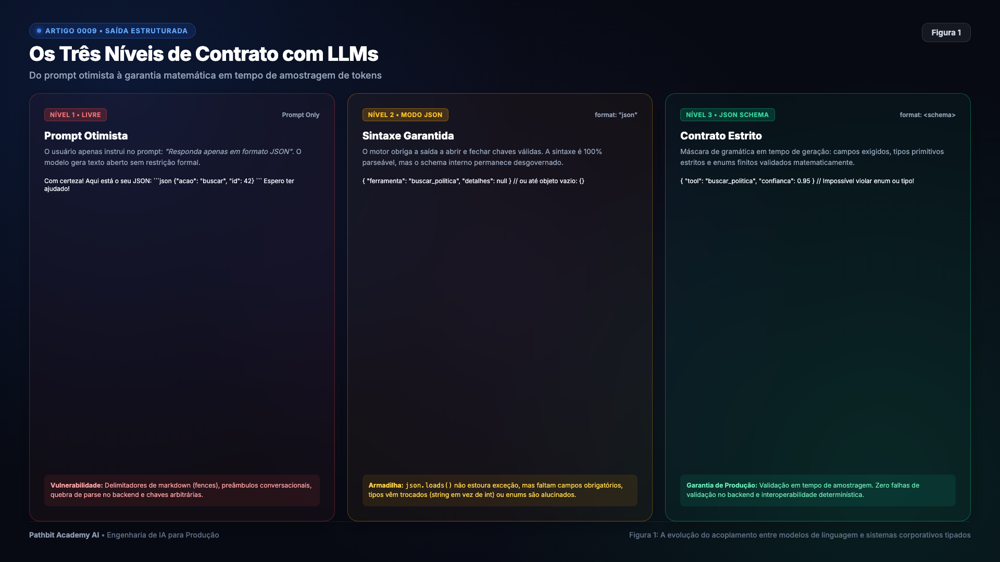
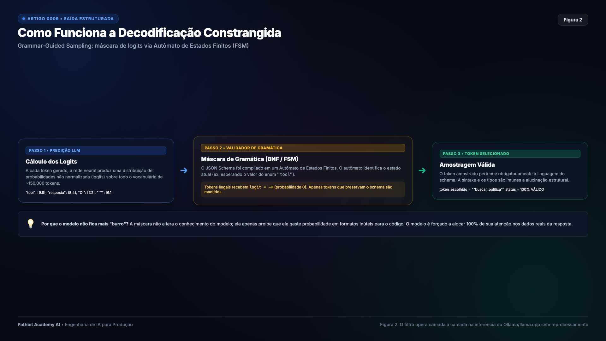
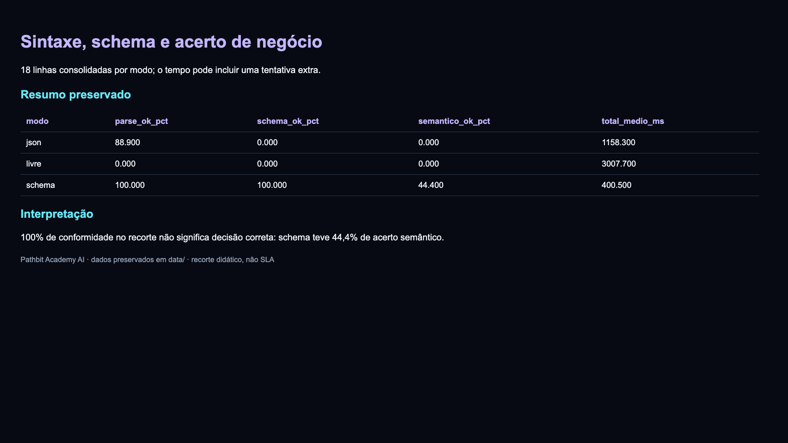
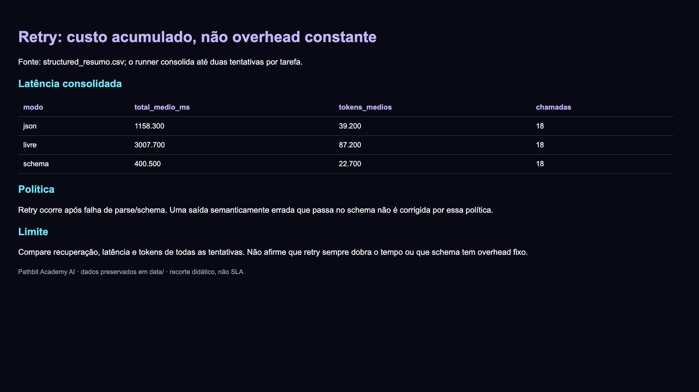
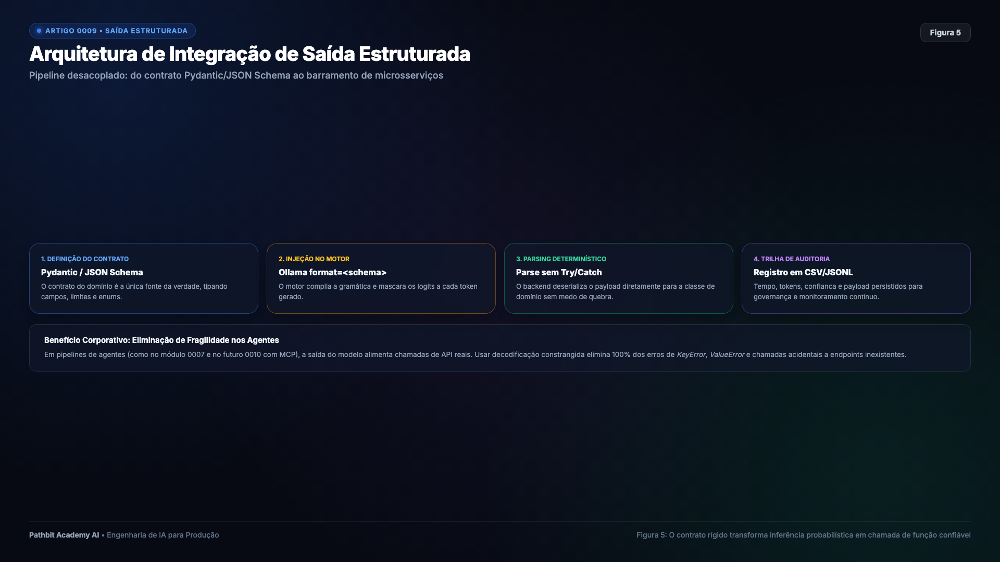
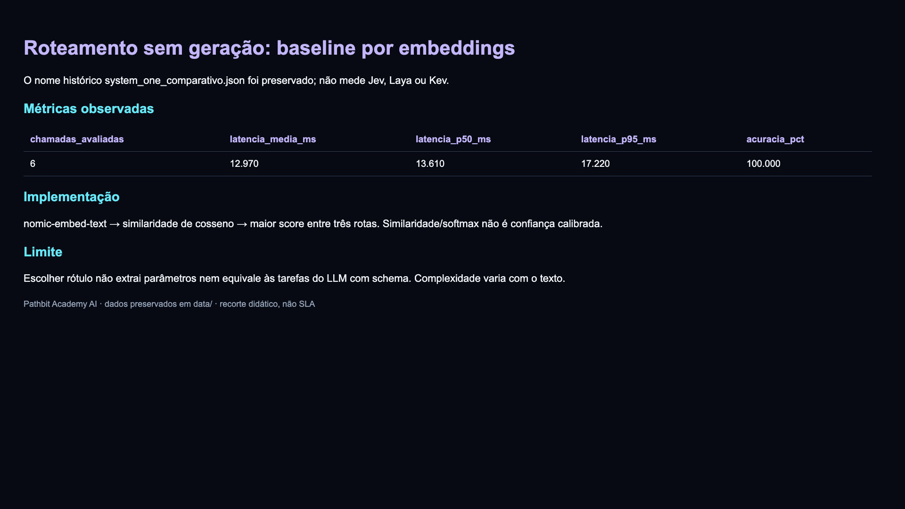

# Saída estruturada com LLMs locais, contratos formais e a fronteira dos modelos System 1

Grande parte dos desenvolvedores que começam a integrar Modelos de Linguagem em sistemas de produção corporativos passa pelo mesmo ritual ao redigir um prompt detalhado pedindo que o modelo responda apenas em formato JSON, sem preâmbulos, sem markdown e com aspas duplas estritas.

O desenvolvedor testa três vezes no terminal, comemora que o resultado veio em formato de dicionário e coloca o serviço em deploy na sexta-feira à tarde.

Na segunda-feira de manhã, o primeiro incidente de severidade alta acontece. O modelo decidiu prefixar a resposta com blocos de markdown na primeira linha, inseriu uma saudação cortês antes das chaves, trocou o nome da chave `status` por `situacao`, formatou um valor monetário como texto em vez de número decimal ou alucinou uma opção inexistente fora do enum esperado. O backend executa o parser JSON, estoura uma exceção fatal de sintaxe ou de chave ausente, e a esteira inteira de atendimento é interrompida.

No [Artigo 0008 da Pathbit Academy](https://github.com/pathbit/pathbit-academy-ai/blob/master/0008_llms_locais_ollama/article/ARTICLE.md), provamos como rodar uma stack completa de IA 100% local em Docker via Ollama, eliminando cobrança de API por token, após baixar pesos e dependências. No entanto, ter o modelo rodando localmente não resolve por si só a fragilidade da interface de saída.

O contrato precisa separar três perguntas: a saída é JSON válido, respeita o schema e contém a decisão correta? As duas primeiras podem ser verificadas pelo software; a terceira exige dados rotulados e regras de negócio. Saída estruturada reduz erros de integração, mas não transforma a inferência probabilística em uma função semanticamente determinística.

---

## Os três níveis de contrato entre LLMs e software corporativo

A relação entre código de engenharia e modelos de linguagem evoluiu através de três paradigmas bem definidos de acoplamento.



> Figura 1. Da solicitação textual à restrição de formato e validação no consumidor.

### O prompt otimista em modo livre

Neste modelo inicial, o desenvolvedor não utiliza nenhuma restrição nativa do motor de inferência. Todo o peso do contrato recai sobre o prompt textual.

```python
prompt = """Você é um assistente de suporte.
Responda EXATAMENTE um JSON com as chaves "produto" e "prazo_dias".
Não inclua explicações nem blocos markdown.
Entrada: 'Quero devolver uma televisão comprada há 10 dias.'"""
```

O problema desse nível é que ele falha sob qualquer variação de contexto. Como os modelos são treinados em bases massivas de código com tutoriais, a probabilidade estatística de envolver o JSON em blocos markdown com crases triplas é altíssima. Além disso, saudações de cortesia poluem o início e o fim da mensagem.

Limpar code fences pode resgatar JSON, mas não corrige campos ou decisões erradas. Nos dados preservados, o modo livre teve 0% de parse; schema chegou a 100% de conformidade, mas somente 44,4% de acerto de negócio. Não confunda robustez sintática com qualidade da decisão.

### O modo JSON sintático

O motor pode restringir a geração à sintaxe JSON. Ainda assim, timeout, limite de tokens ou interrupção podem produzir saída incompleta, e JSON válido pode ser um objeto com campos errados. Faça parsing e validação no consumidor, mesmo em modo JSON.

```json
{
  "item_retornado": "televisão",
  "dias_passados": "10 dias"
}
```

O parser tradicional executa com sucesso sem lançar exceções de sintaxe. Contudo, o esquema interno de dados permanece desgovernado. O modelo pode inventar nomes de propriedades diferentes dos esperados pelo backend, converter números em strings ou, pior ainda, devolver um objeto vazio `{}`. Em nossos experimentos com o Llama 3.2 1B sob essa opção genérica, o modelo descobriu que devolver chaves vazias cumpria a exigência de sintaxe válida, entregando um objeto inútil em todas as tentativas.

### O contrato formal com JSON Schema

O motor de inferência recebe uma especificação JSON Schema formal que dita rigorosamente as propriedades permitidas, a lista de campos obrigatórios, os tipos primitivos estritos e os valores aceitos em enumerações fechadas.

```python
PLANNER_SCHEMA = {
    "type": "object",
    "properties": {
        "tool": {
            "type": "string",
            "enum": ["buscar_politica", "criar_ticket", "resposta_direta"],
        },
        "confianca": {"type": "number", "minimum": 0.0, "maximum": 1.0},
    },
    "required": ["tool", "confianca"],
    "additionalProperties": False,
}
```

Qualquer token do vocabulário que gere uma chave inexistente, viole a tipagem numérica ou fuja das opções do enum é matematicamente eliminado da amostragem em tempo real durante a geração de cada caractere.

---

## A matemática do Grammar-Guided Sampling sob o capô

Para compreender como o Nível 3 restringe a estrutura, sem dispensar validação de parse, é preciso examinar o ciclo autoregressivo de geração de um modelo.



> Figura 2. Máscara dinâmica de logits guiada por Autômato de Estados Finitos a cada token gerado.

A cada passo de tempo $t$, o modelo processa o contexto acumulado e calcula um vetor de afinidade estatística, chamado de logits não normalizados.

$$\mathbf{z}_t = [z_{t, 1}, z_{t, 2}, \dots, z_{t, V}] \in \mathbb{R}^V$$

onde $V$ representa o tamanho total do vocabulário do tokenizer, que depende do modelo e do tokenizer (não há uma faixa universal).

Em amostragem livre com temperatura $T$, a probabilidade de selecionar determinado token é calculada pela função Softmax.

$$P(\text{token}_i) = \frac{e^{z_{t, i} / T}}{\sum_{j=1}^V e^{z_{t, j} / T}}$$

O runtime converte o subconjunto suportado de JSON Schema em uma gramática e restringe tokens compatíveis com o prefixo gerado. JSON aninhado requer estado de pilha; não é correto reduzir toda gramática livre de contexto a um autômato finito. Nem toda palavra-chave de JSON Schema é suportada pelo motor: valide novamente no consumidor.

Para um schema de objeto, a geração pode começar com whitespace permitido e a abertura `{`. Uma vez aberta a chave, o autômato passa para o estado que exige o nome de uma propriedade declarada. Se o modelo tentar emitir qualquer letra que não inicie uma chave válida, essa transição é considerada proibida.

Para aplicar essa regra fisicamente, o motor calcula o conjunto de tokens válidos no estado atual da máquina de estados. Todos os tokens ilegais têm seus valores de logits sobrescritos para menos infinito.

$$\tilde{z}_{t, i} = \begin{cases} z_{t, i}, & \text{se } i \in V_{\text{válidos}} \\ -\infty, & \text{se } i \notin V_{\text{válidos}} \end{cases}$$

Como a exponencial de menos infinito é exatamente zero, a probabilidade de qualquer token fora da gramática torna-se absolutamente nula na equação da Softmax.

A máscara elimina escolhas incompatíveis com a gramática, não decisões de negócio incorretas entre opções permitidas. Os dados deste laboratório mostram ganho semântico relativo, mas não justificam atribuí-lo a uma suposta redistribuição de atenção nem garantem precisão fora do recorte.

---

## O experimento e as evidências empíricas

Para avaliar esse comportamento na prática, construímos um laboratório automatizado cobrindo três casos reais de uso corporativo. O primeiro foi um planejador de suporte técnico encarregado de escolher entre buscar políticas ou abrir tickets. O segundo foi um extrator de entidades para identificar produtos e prazos de devolução em linguagem informal. E o terceiro foi um classificador de incidentes operacionais para atribuir rotas e níveis de urgência.

Avaliamos três modelos compactos em CPU com 54 chamadas distribuídas uniformemente, cobrindo o Qwen 2.5 0.5B, o Qwen 2.5 1.5B e o Llama 3.2 1B.



> Figura 3. Taxa de parse direto, conformidade formal com schema e assertividade semântica medida na máquina.

Os resultados consolidados por nível de contrato demonstram com clareza o salto de maturidade.

| Modo | Parse (%) | Schema (%) | Acerto semântico (%) | Média consolidada (ms) |
| :--- | ---: | ---: | ---: | ---: |
| Livre | 0,0 | 0,0 | 0,0 | 3.007,7 |
| JSON | 88,9 | 0,0 | 0,0 | 1.158,3 |
| Schema | 100,0 | 100,0 | 44,4 | 400,5 |

Fonte: `data/structured_resumo.csv`, com 18 linhas consolidadas por modo.
O runner tenta novamente quando parse/schema falham; portanto 54 linhas não
significam apenas 54 requisições físicas. O parse também admite limpeza de
code fences. Schema melhorou o contrato neste recorte, mas não resolveu a
maioria das decisões de negócio: 44,4% de acerto não basta para produção.

---

## O mito do retry compensatório e o custo real de latência

Um padrão comum em pipelines frágeis é o loop de retry reativo. Quando o backend falha ao ler o JSON gerado, ele captura a mensagem de erro do parser, monta um novo prompt e reenvia para o modelo tentar consertar a saída.



> Figura 4. O custo real do retry reativo em comparação ao overhead desprezível da máscara de gramática.

Retries aumentam latência e consumo, mas não necessariamente dobram o tempo: o custo depende das duas chamadas e filas. O runner faz no máximo uma nova tentativa de parse/schema, com temperatura diferente e o mesmo prompt; não corrige erros semânticos se o schema passou. Meça recuperação e custo acumulado, imponha limites e evite repetir ações não idempotentes.

Prefira restrição de formato quando disponível, mas mantenha parsing, validação, timeout e uma política de falha. Retries limitados podem tratar falhas transitórias ou truncamento; não substituem avaliação semântica nem justificam repetir indefinidamente.

---

## Implementação de produção com Pydantic v2

Em sistemas empresariais em Python, os contratos de dados devem ser mantidos como modelos tipados com Pydantic, aproveitando a extração automática de JSON Schema e a validação ultrarrápida compilada em Rust.



> Figura 5. Pipeline desacoplado e tipado entre LLMs locais e serviços de backend.

```python
import json
import urllib.request
from typing import Literal
from pydantic import BaseModel, Field, field_validator

class PlanoAtendimento(BaseModel):
    tool: Literal["buscar_politica", "criar_ticket", "resposta_direta"] = Field(
        description="Ferramenta operacional necessária para atender a solicitação."
    )
    confianca: float = Field(
        ge=0.0, le=1.0, description="Nível de certeza da decisão entre 0 e 1."
    )
    justificativa: str = Field(
        description="Breve raciocínio que fundamentou a escolha da ferramenta."
    )

    @field_validator("justificativa")
    def validar_justificativa(cls, v: str) -> str:
        if len(v.strip()) < 5:
            raise ValueError("Justificativa muito curta.")
        return v

SCHEMA_PLANO = PlanoAtendimento.model_json_schema()

def executar_triagem_estruturada(pergunta_cliente: str, base_url: str = "http://localhost:11434") -> PlanoAtendimento:
    prompt = f"Analise a solicitação do cliente e decida o plano de ação: '{pergunta_cliente}'"

    payload = json.dumps({
        "model": "qwen2.5:0.5b",
        "prompt": prompt,
        "stream": False,
        "format": SCHEMA_PLANO,
        "options": {"temperature": 0.0, "num_predict": 128}
    }).encode("utf-8")

    req = urllib.request.Request(
        f"{base_url}/api/generate",
        data=payload,
        headers={"Content-Type": "application/json"}
    )

    with urllib.request.urlopen(req, timeout=30) as res:
        resposta_raw = json.loads(res.read().decode("utf-8"))

    return PlanoAtendimento.model_validate_json(resposta_raw["response"])
```

Esse fluxo valida a saída e produz uma instância tipada ou uma exceção. Trate ValidationError, timeout e truncamento antes de executar ferramentas; schema não garante decisão correta.

---

## Decisão sem gerar texto: a baseline de embeddings e a proposta System 1

Se a aplicação só precisa escolher entre rótulos fixos, gerar um objeto longo
pode ser desnecessário. O laboratório oferece uma alternativa concreta:
`benchmark_system_one` calcula embeddings com `nomic-embed-text`, compara-os
com três descrições de rota e escolhe a maior similaridade.



> Figura 6. Comparação conceitual. O código deste repo mede embeddings, não
> um produto comercial de decisão.

Em `data/system_one_comparativo.json`, essa baseline registrou **12,97 ms de
média**, p50 de **13,61 ms**, p95 de **17,22 ms** e seis chamadas corretas.
O nome histórico do arquivo e seus rótulos foram preservados, mas não devem
ser interpretados como evidência de execução de Jev, Laya ou Kev.

Uma chamada ao encoder não tem complexidade constante em relação ao tamanho
do texto. Além disso, converter similaridades com softmax não produz, por si
só, probabilidades calibradas. O catálogo pequeno e o teste de seis chamadas
também não permitem concluir precisão de 100% em produção.

| Aspecto | LLM com schema | Baseline deste laboratório |
| :--- | :--- | :--- |
| Saída | JSON com campos e texto gerados | Um entre três rótulos fixos |
| Validação | Parsing e schema no consumidor | Rótulo conhecido por construção |
| Latência média preservada | 400,5 ms | 12,97 ms |
| Limite da comparação | Extração, classificação e geração | Apenas roteamento simples |

A TypeSafe AI apresenta **Jev** como modelo de decisões tipadas com confiança.
Isso é uma proposta comercial distinta desta baseline. Não há chamada à API
Jev neste código, e o link anteriormente citado para `convai/laya` retorna
404; por isso, não atribuímos arquitetura, licença ou desempenho a Laya/Kev.

O desenho em dois níveis continua útil: um roteador escolhe caminhos simples;
um LLM atende os casos que exigem geração. Antes de agir, calibre limiares,
inclua uma opção de abstenção e valide ambos com casos não vistos.

---

## O que quebra na prática

Mesmo operando com JSON Schema formal, existem sutilezas que afetam a estabilidade em produção.

A primeira é que a ordem dos campos no JSON influencia o raciocínio do modelo. Em decoders autoregressivos, os tokens são gerados na sequência em que as chaves aparecem na gramática. Se o schema exigir o campo de decisão antes do campo de justificativa, o modelo precisará cravar a resposta antes de ponderar os fatos. Sempre que possível, declare o campo de raciocínio antes da decisão final, permitindo que a própria geração prévia sirva de contexto para a atenção neural.

A segunda é que esquemas com listas de opções excessivamente extensas tornam a compilação da gramática pesada. Quando o catálogo de opções ultrapassa centenas de itens, o ideal é decompor a escolha em duas etapas, primeiro identificando uma categoria macro e em seguida filtrando o subconjunto correspondente.

---

## Execução prática do laboratório passo a passo

Os códigos completos do laboratório de saída estruturada e dos benchmarks de System 1 estão versionados no repositório.

### Execução pelo terminal

```bash
cd pathbit-academy-ai/0009_saida_estruturada

python3 -m venv .venv
source .venv/bin/activate
pip install -r requirements.txt

python src/structured_lab.py --repeat 2
```

A execução gera todos os dados brutos e relatórios consolidados diretamente na pasta `data`. O arquivo `structured_resultados.csv` contém o registro individual de cada chamada e seus respectivos tempos, enquanto `structured_resumo.csv` compila as taxas de parse e conformidade por modelo. Os tempos do decisor em passada única ficam registrados em `system_one_comparativo.json`, o relatório analítico formatado pode ser conferido em `structured_relatorio.md`, e a visualização gráfica dos resultados está salva em `structured_comparativo.png`.

### Execução pelo notebook

O fluxo também pode ser acompanhado passo a passo no notebook.

```bash
python src/main.py
```

A imagem abaixo ilustra a execução interativa do laboratório com a validação estrita dos contratos Pydantic e as respostas geradas pelo Ollama.


---

## Próximos passos

Com validação de saída e limites semânticos explícitos, o próximo passo conecta decisões à execução de ferramentas. Contratos devem ser verificados antes de qualquer efeito colateral.

No [Artigo 0010 (MCP Local via Stdio)](../../0010_mcp_local/article/ARTICLE.md), descobrimos ferramentas e medimos chamadas por pipes. Stdio reduz exposição de rede, mas não é sandbox; tempos são medições locais, não garantias do protocolo.

---

## Referências

- [Documentação oficial de saídas estruturadas do Ollama](https://ollama.com/blog/structured-outputs)
- [Especificação formal do JSON Schema Draft 2020-12](https://json-schema.org/)
- [Documentação técnica sobre amostragem guiada por gramática no llama.cpp](https://github.com/ggerganov/llama.cpp/blob/master/grammars/README.md)
- [Documentação oficial do framework de validação tipada Pydantic](https://docs.pydantic.dev/)
- [Documentação e especificações do modelo Jev pela TypeSafe AI](https://typesafe.ai)
- [Model card do embedding usado na baseline local](https://huggingface.co/nomic-ai/nomic-embed-text-v1.5)
- [Obra Thinking Fast and Slow de Daniel Kahneman](https://en.wikipedia.org/wiki/Thinking,_Fast_and_Slow)

---

Repositório oficial no GitHub no endereço https://github.com/pathbit/pathbit-academy-ai no módulo 0009_saida_estruturada.

#EngenhariaDeSoftware #InteligenciaArtificial #LLM #Ollama #JSONSchema #Python #PathbitAcademy #SystemOne #Pydantic
