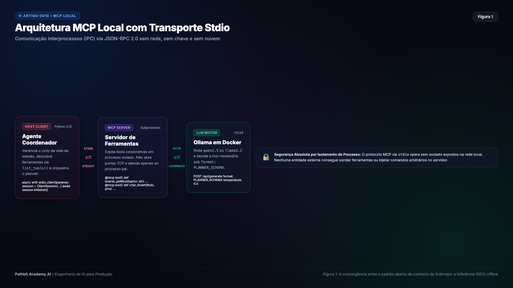
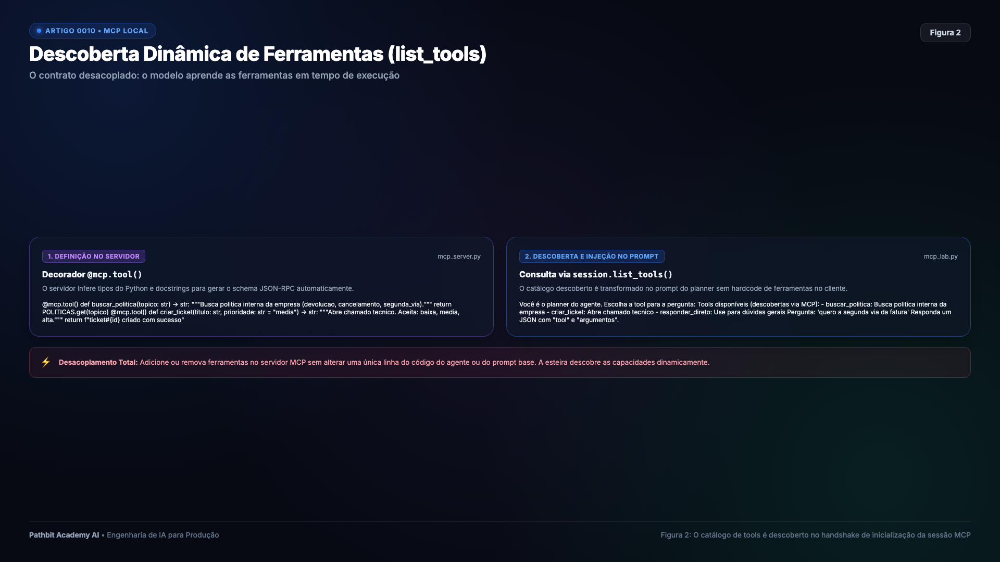
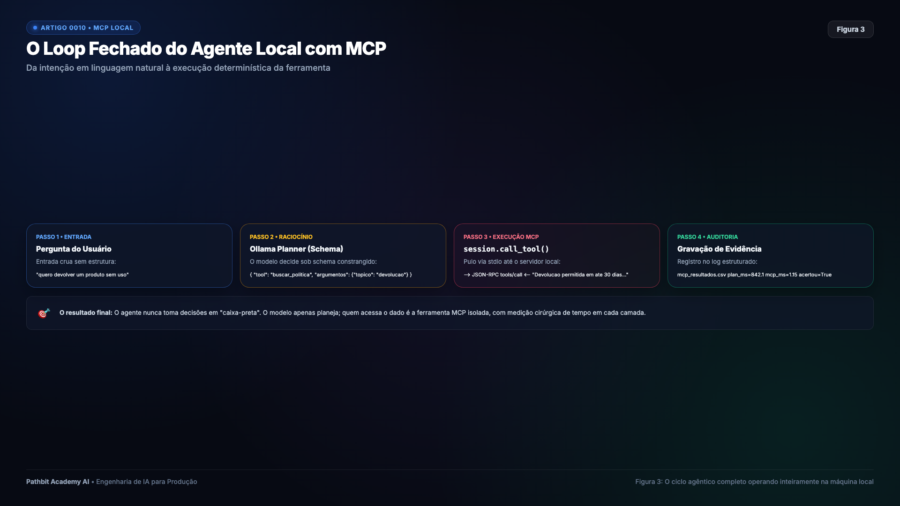
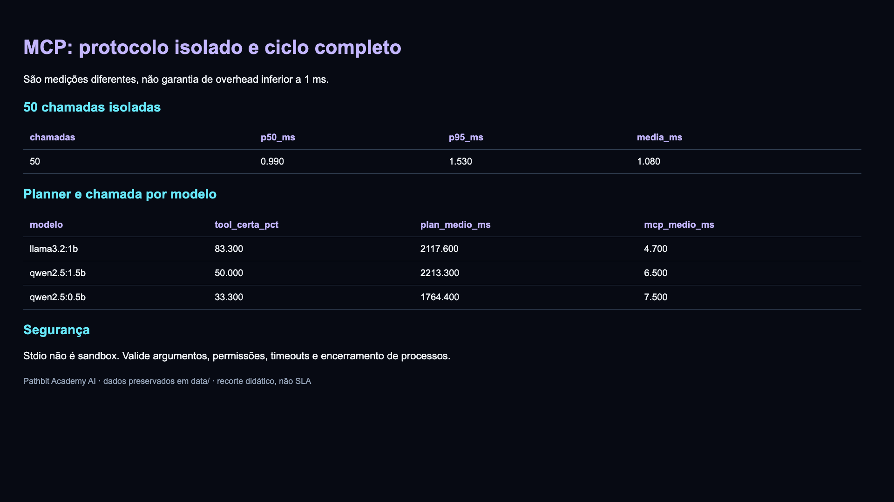
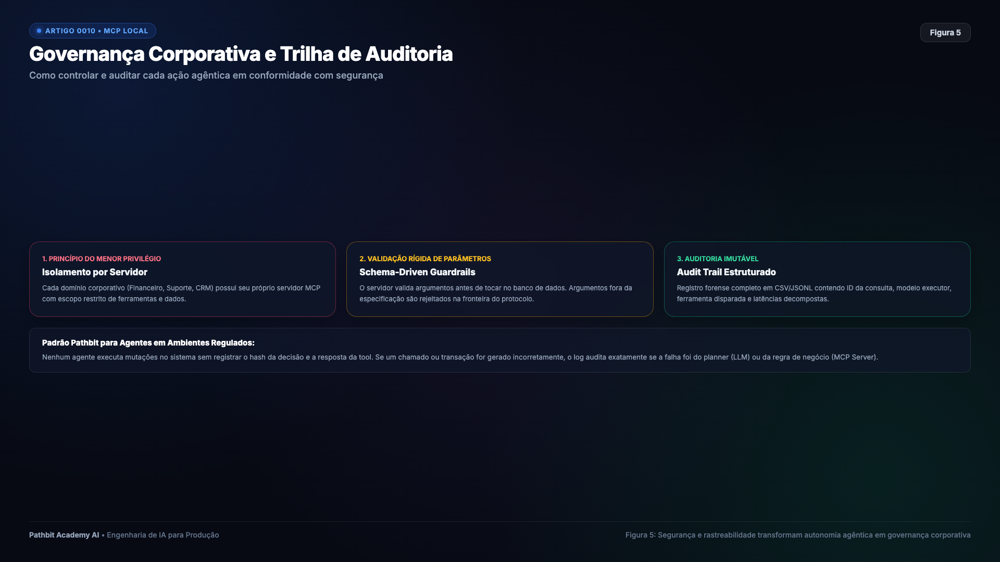

# MCP local com Ollama e o protocolo aberto para ferramentas sem rede, sem chave e sem nuvem

A evolução dos agentes de inteligência artificial nos últimos anos esbarrou em um problema crônico e bem conhecido da engenharia de software, que é o acoplamento combinatorial.

Quando uma equipe precisava conectar diferentes modelos ou bibliotecas de agentes a ferramentas corporativas, como consultas SQL, APIs internas ou rotinas de infraestrutura, o resultado era uma proliferação de adaptadores sob medida. Cada integração exigia prompts artesanais de descrição de funções, deserializadores manuais de JSON, tratamentos de erro isolados e uma fragilidade imensa a cada atualização de biblioteca.

A indústria de software já resolveu esse mesmo dilema no passado. Nos anos 2010, conectar múltiplos editores de código a diferentes compiladores exigia dezenas de plugins específicos. A Microsoft resolveu o impasse criando o Language Server Protocol (LSP), um contrato padronizado que unificou editores e linguagens.

A Anthropic propôs a mesma lógica para o ecossistema de inteligência artificial ao publicar a especificação aberta do Model Context Protocol (MCP). A proposta é atuar como o protocolo universal dos agentes, padronizando a forma como modelos de linguagem descobrem e interagem com ferramentas executáveis, fontes de dados e instruções de contexto.

Nos artigos anteriores da trilogia, provamos a inferência de modelos locais em Docker e a validação de contratos de saída com JSON Schema. Neste artigo, conectamos um servidor MCP local via transporte stdio a modelos locais no Ollama, viabilizando agentes autônomos e auditáveis sem abrir uma porta para o servidor MCP, sem tráfego de dados externo e sem custos de API por requisição.

---

## A arquitetura da especificação MCP e seus três pilares

O Model Context Protocol é construído sobre a especificação JSON-RPC 2.0, estruturando a comunicação entre o cliente coordenador e os servidores de contexto por meio de três primitivas fundamentais.



> Figura 1. O cliente inicia o servidor MCP como subprocesso direto, trocando mensagens JSON-RPC 2.0 por pipes do sistema operacional.

O primeiro pilar reúne as ferramentas, conhecidas na especificação como tools. Elas representam funções executáveis que causam ações ou efeitos no ambiente, como abrir tickets de suporte, consultar tabelas em banco relacional ou disparar rotinas de infraestrutura. Cada ferramenta expõe seu nome, uma descrição textual compreensível para o modelo e um esquema formal de parâmetros no padrão JSON Schema.

O segundo pilar são os recursos, ou resources. Trata-se de dados contextuais puramente passivos, identificados por identificadores de URI como `suporte://politicas/devolucao` ou `file:///var/log/app.log`. Diferente das ferramentas, os recursos não causam efeitos colaterais e servem para alimentar a leitura de documentos e arquivos de suporte.

O terceiro pilar são os prompts. Eles funcionam como modelos pré-formatados de instruções mantidos diretamente pelo servidor MCP. Isso permite que a equipe dona do domínio de negócio atualize a forma como o agente deve raciocinar sem precisar alterar uma única linha de código no cliente que o consome.

---

## Stdio reduz a exposição de rede, mas não substitui isolamento

Os transportes padrão atuais são **stdio** e **Streamable HTTP**. Este último substituiu o antigo HTTP+SSE e pode usar SSE para streaming. Neste laboratório, o cliente lança o servidor de ferramentas como subprocesso e troca JSON-RPC por stdin/stdout; o Ollama continua atendendo por HTTP local.

| Critério de Engenharia | Transporte stdio por Pipes | Transporte SSE por HTTP |
| :--- | :--- | :--- |
| Exposição de Rede | Nenhuma porta aberta na máquina | Abre portas locais como 8080 ou 3000 |
| Varredura de Portas | Totalmente imune a scans locais | Visível para outros processos locais |
| Gestão de Credenciais | O servidor guarda segredos isolados | Credenciais trafegam em cabeçalhos |
| Ciclo de Vida do Processo | Encerra junto com o processo pai | Risco de processos órfãos em background |
| Sobrecarga de comunicação | Medir pipes e serialização | Medir HTTP, streaming e rede |

No transporte stdio, o cliente instancia o servidor MCP como um subprocesso filho por meio de chamadas de sistema no kernel. O descritor de entrada padrão (stdin) do filho é conectado ao canal de escrita do pai, e o descritor de saída padrão (stdout) é conectado ao canal de leitura.

Stdio evita abrir uma porta HTTP para o servidor de ferramentas, mas o subprocesso herda permissões do usuário e pode acessar arquivos ou rede. Não é um sandbox. O fechamento dos pipes também não garante que qualquer filho termine automaticamente: o cliente precisa gerenciar encerramento e timeouts. Restrinja privilégios e valide parâmetros antes de executar ações.

---

## Descoberta dinâmica de ferramentas em tempo de execução

Em abordagens agênticas tradicionais, adicionar uma nova funcionalidade exige atualizar manualmente o prompt de sistema do cliente, reescrever esquemas e publicar uma nova versão de todo o software.

Com o MCP, o catálogo de capacidades é descoberto durante a inicialização da sessão.



> Figura 2. O cliente descobre o catálogo e os esquemas das ferramentas no início da sessão sem alterações no código principal.

Durante o handshake inicial, o cliente envia uma mensagem JSON-RPC de inicialização e recebe as capacidades suportadas pelo servidor. Em seguida, uma chamada ao método `tools/list` devolve a lista completa de ferramentas com suas descrições e os parâmetros esperados.

No arquivo `src/mcp_server.py`, usamos o SDK oficial em Python para expor funções de atendimento decoradas com metadados claros.

```python
from mcp.server.mcpserver import MCPServer

mcp = MCPServer("pathbit-suporte")

POLITICAS = {
    "devolucao": "Devolução permitida em até 30 dias corridos para produtos sem uso.",
    "cancelamento": "Cancelamento sem multa pode ser solicitado em até 7 dias corridos.",
    "segunda_via": "A segunda via da fatura é emitida no portal do cliente, aba Financeiro.",
}

@mcp.tool()
def buscar_politica(topico: str) -> str:
    """Busca uma política interna da empresa pelo tópico."""
    return POLITICAS.get(topico.lower().replace(" ", "_"), f"Política '{topico}' não encontrada.")

@mcp.tool()
def criar_ticket(titulo: str, prioridade: str = "media") -> str:
    """Abre um ticket de suporte técnico."""
    if prioridade not in ("baixa", "media", "alta"):
        return f"Erro: prioridade inválida '{prioridade}'"
    return f"Ticket #2041 aberto com sucesso: '{titulo}' (prioridade {prioridade})"

if __name__ == "__main__":
    mcp.run()
```

Se a equipe de desenvolvimento adicionar novas funções de suporte nesse servidor, o agente passa a utilizá-las na inicialização seguinte, sem que seu código precise ser alterado ou recompilado.

---

## O loop fechado do agente local com MCP e Ollama

Combinando o servidor MCP com a saída estruturada do módulo 0009 e os modelos locais do módulo 0008, o fluxo de execução se organiza em quatro etapas coordenadas.



> Figura 3. As quatro etapas do ciclo agêntico, com leitura da pergunta, planejamento constrangido, invocação segura por stdio e registro de auditoria.

Na primeira etapa, o catálogo descoberto dinamicamente é injetado no prompt de planejamento do modelo. 

O planner recebe um schema de envelope com nomes de ferramentas e campos possíveis. Isso não substitui o `inputSchema` de cada ferramenta: valide o nome no catálogo descoberto e os argumentos no schema correspondente antes de `call_tool`. A escolha semanticamente correta continua dependendo do modelo.

Na terceira etapa, o cliente despacha a chamada diretamente para a sessão do MCP.

```python
resultado = await session.call_tool(
    plano["tool"],
    arguments=plano["argumentos"]
)
conteudo_retorno = resultado.content[0].text
```

Na quarta etapa, o resultado retornado pela ferramenta é incorporado ao contexto do modelo para gerar a conclusão ao usuário ou acionar novas decisões.

Um roteador não generativo pode atender catálogos pequenos, como a baseline por embeddings do artigo 0009. Não medimos Jev nem Laya e não demonstramos um agente completo abaixo de 20 ms. Decisão, validação e execução precisam ser avaliadas separadamente.

---

## Decomposição de latência entre sobrecarga de protocolo e inferência

Uma preocupação natural de engenharia ao adotar uma nova camada de abstração é o custo de desempenho que ela adiciona. Para responder a essa questão com dados concretos, executamos 50 chamadas sucessivas de protocolo MCP isoladas, medindo estritamente a comunicação por stdio sem processamento de modelo no meio do caminho.



> Figura 4. Medição de 50 chamadas de protocolo isoladas no loopback, comprovando mediana de 0.99 milissegundo de sobrecarga.

Os números registrados na máquina mostram mediana de 0.99 milissegundo, percentil 95 de 1.53 milissegundo e média global de 1.08 milissegundo.

Quando comparamos esse overhead com o tempo de planejamento dos modelos compactos em CPU, a relação fica evidente nos números apurados.

| Modelo | Validade Estrutural do Plano (%) | Acurácia de Escolha da Tool (%) | Argumentos Válidos (%) | Latência Média do Planner (ms) | Sobrecarga de Protocolo MCP (ms) |
| :--- | :---: | :---: | :---: | :---: | :---: |
| `llama3.2:1b` | 100% | 83.3% | 100% | 2.117 ms | 4.7 ms |
| `qwen2.5:1.5b` | 100% | 50.0% | 100% | 2.213 ms | 6.5 ms |
| `qwen2.5:0.5b` | 100% | 33.3% | 100% | 1.764 ms | 7.5 ms |

Em `mcp_resumo.csv`, as médias de chamada MCP variam de **4,7 a 7,5 ms**, enquanto o planner leva **1.764,4 a 2.213,3 ms**. A medição isolada de 50 chamadas registra p50 0,99 ms e p95 1,53 ms. São recortes diferentes; não conclua que toda chamada custa menos de 1 ms nem que o protocolo representa sempre menos de 0,25% da latência.

---

## Governança corporativa e trilha de auditoria

Em operações corporativas em áreas como bancos ou seguros, agentes autônomos não podem atuar sem rastreabilidade. Cada ação executada, seja uma consulta cadastral ou a abertura de um ticket, precisa deixar um registro transparente e revisável.



> Figura 5. Menor privilégio, validação estrita e auditoria estruturada linha a linha.

No laboratório, cada decisão tomada pelo agente é salva em formato estruturado no arquivo `data/mcp_resultados.csv`:

```csv
modelo,consulta_id,repeticao,tool_escolhida,tool_esperada,acertou,argumento_ok,schema_ok,plan_ms,mcp_ms,tokens
qwen2.5:0.5b,q_fatura,0,buscar_politica,buscar_politica,True,True,True,1002.7,9.06,23
qwen2.5:0.5b,q_devolucao,0,buscar_politica,buscar_politica,True,True,True,1157.6,7.27,23
qwen2.5:0.5b,q_incidente,0,buscar_politica,criar_ticket,False,True,True,1334.8,6.85,28
```

Se um cliente questionar por que uma solicitação foi tratada como cancelamento em vez de dúvida simples, o registro permite identificar com clareza qual ID de modelo e consulta foram registrados, quanto tempo levou o plano e qual ferramenta foi selecionada. O CSV não armazena digest dos pesos, prompt completo ou todos os argumentos; registre esses dados com política de privacidade se precisar reproduzir uma decisão em produção.

---

## O que quebra na prática

Trabalhar com servidores MCP locais por canais de stdio exige atenção a detalhes de baixo nível do sistema operacional.

O primeiro cuidado é o buffering de saída padrão no Python. Quando o interpretador detecta que a saída padrão não é um terminal interativo, ele retém os dados em buffers de bloco até acumular vários kilobytes. Com isso, o servidor MCP pode gerar uma resposta perfeitamente válida, mas os bytes ficam retidos na memória do processo filho, deixando o cliente aguardando em deadlock. A solução é executar o processo com a variável de ambiente `PYTHONUNBUFFERED=1` ou passar a opção `-u` no comando de inicialização.

O segundo cuidado é a contaminação do canal por instruções comuns de print para depuração. Se uma função do servidor emitir um print casual, essa mensagem de texto é escrita diretamente na saída padrão compartilhada com o protocolo. O cliente, que espera exclusivamente mensagens JSON-RPC, falha ao tentar interpretar o texto como JSON e interrompe a sessão. Em servidores MCP locais, qualquer informação de log ou diagnóstico deve ser enviada estritamente para o descritor de erro (stderr) ou gravada em arquivos de log dedicados.

---

## Execução prática do laboratório passo a passo

Os códigos do servidor MCP, do cliente agêntico e dos testes automatizados estão disponíveis no repositório.

### Execução pelo terminal

```bash
cd pathbit-academy-ai/0010_mcp_local

python3 -m venv .venv
source .venv/bin/activate
pip install -r requirements.txt

python src/mcp_lab.py --repeat 2
```

Ao final da bateria de testes, os dados coletados são salvos na pasta `data` para conferência. O catálogo de funções descobertas na inicialização fica armazenado em `catalogo_tools.json`, enquanto `mcp_latencia_protocolo.json` contém as 50 medições de sobrecarga de transporte. O registro forense de cada chamada efetuada pelo agente é guardado em `mcp_resultados.csv`, o sumário de acertos e latências consolidadas em `mcp_resumo.csv`, o relatório técnico completo em `mcp_relatorio.md`, e a comparação gráfica em `mcp_comparativo.png`.

### Execução pelo notebook

O experimento completo também pode ser acompanhado de forma interativa no Jupyter Notebook.

```bash
python src/main.py
```

Abaixo está o registro da execução com a inicialização do servidor e as chamadas reais via stdio.


---

## Conclusão da trilogia de infraestrutura de IA local

Com este artigo, a Pathbit Academy conclui a trilogia fundamental para quem precisa operar sistemas de inteligência artificial de forma independente, controlada e orientada à engenharia de software.

No [Artigo 0008 (LLMs Locais com Ollama)](https://github.com/pathbit/pathbit-academy-ai/blob/master/0008_llms_locais_ollama/article/ARTICLE.md), mostramos a infraestrutura para servir modelos e embeddings localmente em Docker sem cobrança de API por token.

No [Artigo 0009 (Saída Estruturada e Modelos System 1)](https://github.com/pathbit/pathbit-academy-ai/blob/master/0009_saida_estruturada/article/ARTICLE.md), eliminamos a fragilidade de formato por meio de Grammar-Guided Sampling com JSON Schema e exploramos a fronteira de modelos de decisão rápida em passada única.

No [Artigo 0010 (MCP Local via Stdio)](https://github.com/pathbit/pathbit-academy-ai/blob/master/0010_mcp_local/article/ARTICLE.md), unificamos tudo sob um protocolo aberto da indústria, permitindo que agentes acionem ferramentas corporativas reais por subprocessos gerenciados e latência medida, sem garantia de sandbox.

Essa base oferece o caminho técnico necessário para levar agentes de IA para produção em escala com previsibilidade, segurança de dados e governança completa.

---

## Referências

- [Especificação oficial do Model Context Protocol pela Anthropic](https://modelcontextprotocol.io/)
- [SDK oficial em Python para Model Context Protocol](https://github.com/modelcontextprotocol/python-sdk)
- [Especificação técnica do protocolo JSON-RPC 2.0](https://www.jsonrpc.org/specification)
- [Especificação do Language Server Protocol pela Microsoft](https://microsoft.github.io/language-server-protocol/)
- [Documentação oficial da API do Ollama](https://github.com/ollama/ollama/blob/main/docs/api.md)
- [Documentação do framework de validação tipada Pydantic](https://docs.pydantic.dev/)

---

Repositório oficial no GitHub no endereço https://github.com/pathbit/pathbit-academy-ai no módulo 0010_mcp_local.

#InteligenciaArtificial #MCP #ModelContextProtocol #Ollama #Python #OpenSource #SoftwareEngineering #PathbitAcademy #AgenticAI
